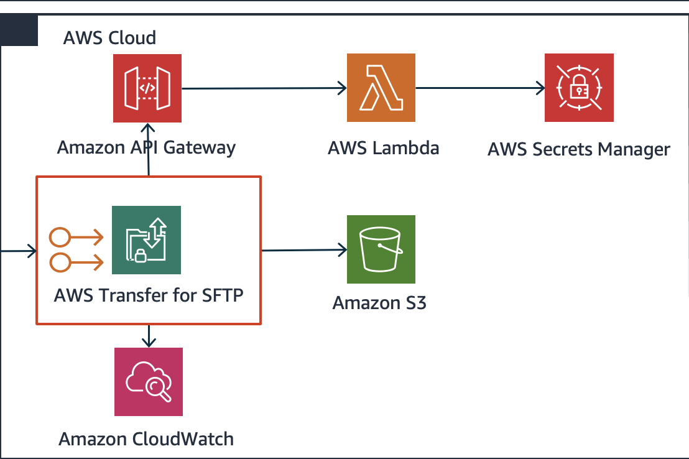

# aws-transfer-family-sftp

## Description
Developers can use this code to build SFTP architectures using Secrets Manager as repository of keys and passwords. Using the code as an example, builders can integrate additional features or customize according with customer needs.

## Architecture

The solution includes a main template for initial setup and other three templates for additional customization that are called by the main one.

The main.template.yaml deployment includes the following components:
* Basic organization of input parameters needed to deploy the architecture (tenancy and availability zones).
* Reference to all others (3) templates which will run nested from central main template.

The vpc-production.template.yaml deployment includes the following:
* Standard, external-facing virtual private cloud (VPC) Multi-AZ architecture with separate subnets for different tiers and private subnets for the back-end tier.
* Managed network address translation (NAT) gateways to allow outbound internet access for resources in the private subnets. Internet Gateways (IGW) to allow internet access in the public subnets. 
* Network access control list (network ACL) rules to filter traffic.

The transfer.template.yaml deployment includes the following:
* AWS Transfer for SFTP server with IAM role enabled to log data to CloudWatch Logs group. The service has two Elastic IPs (EIPs) associated in different Availability Zones (AZ).
* Identity provider (IdP) to authenticate and authorize users, using API Gateway integrated with a Lambda function which query Secrets Manager as a secure data store.
* Security Group (SG) used by Transfer service in order to control access to port TCP:22 (SFTP) from Internet.
* Amazon CloudWatch Dashboard consuming data from SFTP Transfer.

The users.template.yaml deployment includes the following:
* Amazon S3 bucket to be used as central repository for all home directories of users managed in SFTP service. It has Server Side Encryption (SSE) enabled and life cycle policy for transition of objects to Glacier after 90 days of creation.
* Standard IAM User Role and Policy to be used by SFTP users.
* A secret in AWS Secrets Manager that contains demo user configuration settings:
    - Password
    - Role
    - Home Directory
    - Public Key

## Installation
In preparation:
* Confirm your AWS account is set up correctly by checking quota limits and setting up AWS Config, where available.

During deploy:
* Update main.termplate.yaml file with correct path to your other 3 nested templates. By default main template just have an example domain.
* Launch the main.template.yaml template, which will launch all nested additional templates.

After deploy: 
* Assign the new created security group to VPC Endpoint created by AWS Transfer for SFTP service
* Test you sftp connection using demo user. You can see password in the secret created in AWS Secrets Manager with the format SFTP/usecret.

## Contributing
Propose any change, improvment, and new element by opening an issue on this repository.

## License
This code is licensed under the MIT-0 License. See the LICENSE file.
